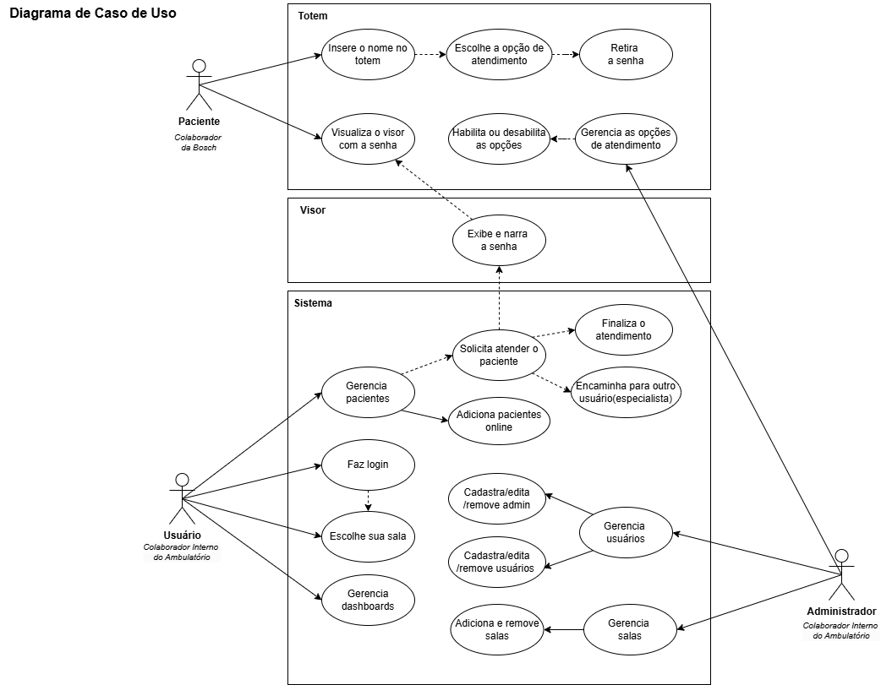
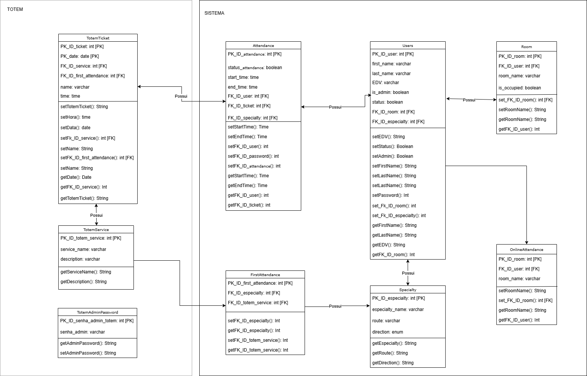

# Requerimentos de Software

## Escopo do projeto

O projeto Aura é composto por três componentes principais. O Totem permite que os pacientes retirem senhas de atendimento por meio de uma interface intuitiva, com suporte para traduções em inglês, espanhol e Libras, garantindo acessibilidade a diversos usuários.

O Visor exibe as senhas e as respectivas portas de atendimento em tempo real, com narração das chamadas para tornar o processo mais inclusivo e eficiente.

O Sistema central gerencia tanto os pacientes quanto os usuários, possibilitando a visualização e atendimento das senhas em tempo real, além do gerenciamento de contas e salas. O sistema também inclui dashboards que fornecem uma visão detalhada do fluxo de atendimentos, apresentando estatísticas como senhas emitidas, atendimentos realizados e tempos médios de espera e atendimento.

## Features

### Artigos Técnicos

### Aura

 É um sistema unificado com 3 elementos, um totem de autoatendimento para retirada de senhas de acordo com o serviço solicitado, um visor para visualização de senhas chamadas e um sistema interno para o gerenciamento dos pacientes do fluxo de atendimentos e um relatório com painéis dos históricos de atendimentos para análise de dados.

## Descrição de Requisitos

### Requisitos Funcionais

#### 1. Funcionalidades do Totem
O totem físico será responsável por gerar senhas e fornecer um atendimento acessível aos pacientes. As funcionalidades do totem incluem:
Interface de Retirada de Senhas:      
O paciente       poderá escolher o tipo de atendimento (e.g., Enfermagem, Medicina).
Geração Automática de Senhas:      
As       senhas serão geradas com uma formatação específica, de acordo com o       serviço escolhido (e.g., EN-001 para Enfermagem).
Impressão de Senha Física:      
Impressão       imediata da senha após sua geração.
Atendimento Emergencial Prioritário:      
Se       for uma emergência, o sistema direcionará automaticamente o paciente para       o atendimento emergencial sem a necessidade de senha regular.
Tradução Automática: 
Tradução       da interface para inglês e espanhol.
Tradução em Libras (Acessibilidade):      
Suporte       à tradução em Libras (Língua Brasileira de Sinais) para garantir       acessibilidade a pacientes com deficiência auditiva.
#### 2. Funcionalidades do Visor
O visor é responsável por exibir o status das senhas e informar aos pacientes sobre seu atendimento. As funcionalidades incluem:
Exibição de Senha e Localização:      
Exibição       da senha chamada com o número e iniciais do serviço, juntamente com a       porta onde o paciente deve se dirigir.
Histórico de Senhas Atualizado em Tempo      Real: 
A       lista de senhas será atualizada dinamicamente após o atendimento de outra       senha.
Narração da Senha: 
O       sistema narrará automaticamente a senha e o local de atendimento quando a       senha for chamada.
#### 3. Funcionalidades do Sistema
#### 3.1. Gerenciamento de Pacientes
As funcionalidades relacionadas ao gerenciamento de pacientes incluem:
Visualização em Tempo Real:      
O       sistema exibirá, em tempo real, as senhas geradas pelo totem.
Atendimento de Senhas: 
O sistema       permitirá que o usuário atenda as senhas recebidas do totem em tempo       real.
Visualização de Informações do Atendimento:      
Visualização       em tempo real dos detalhes da senha atendida, incluindo serviço e       paciente.
Encaminhamento de Atendimento:      
Possibilidade       de encaminhar um paciente para outra especialidade, caso necessário.
Finalização de Atendimento:      
Método       para finalizar um atendimento e removê-lo da lista de espera.
Adição de Pacientes Online:      
Cadastro       de novos pacientes via formulário online, incluindo campos como nome,       data e serviço.
Acompanhamento de Status de Paciente:      
Monitoramento       em tempo real do status de cada paciente, restrito à recepção.
#### 3.2. Gerenciamento de Usuários
Funcionalidades relacionadas ao gerenciamento de usuários do sistema:
Visualização de Lista de Usuários:      
Exibição       de uma lista completa de usuários cadastrados no sistema.
Edição e Deleção de Usuários:      
Administradores       poderão editar ou deletar usuários.
Cadastro de Usuários por E-mail:      
Administradores       poderão registrar novos usuários, enviando um e-mail com um código de       verificação para o primeiro login.
Primeiro Login para Usuários Internos:      
Durante       o primeiro login, os usuários internos deverão completar seus dados       (e.g., nome, sobrenome, especialidade).
Login via Azure SSO (Usuários Internos):      
Usuários       internos poderão acessar o sistema utilizando login via Azure Single       Sign-On (SSO).
Primeiro Login para Usuários Externos:      
Usuários       externos também devem completar seus dados no primeiro login (e.g., nome,       sobrenome, especialidade).
Login por EDV e Senha (Usuários Externos):      
Usuários       externos poderão acessar o sistema utilizando EDV e senha.
Escolha de Sala no Login: 
O       login será completo apenas após a escolha de uma sala de atendimento.
Visualização e Gerenciamento de Salas:      
Visualização       de salas disponíveis. Administradores poderão adicionar e deletar salas.      
Página de Suporte:
·       Página com os contatos dos desenvolvedores do projeto, disponível para todos os usuários.
#### 4. Dashboards
O sistema incluirá dashboards interativos para o monitoramento e análise de dados relacionados ao atendimento:
Dashboard Interativo: 
Visualização       do fluxo diário de pacientes e controle dos tipos de atendimentos e       serviços.
Integração com MetaBase: 
Todos       os dashboards serão integrados ao sistema utilizando a ferramenta       MetaBase.
Tipos de Dashboards Disponíveis:      
Total       de senhas retiradas no totem por data.
Total       de senhas por serviço.
Total       de atendimentos por usuário.
Tempo       de atendimento por usuário.
Média       de tempo total do paciente no ambulatório.
Média       de tempo de espera do paciente na recepção até o atendimento.
#### 5. Controle de Acesso
O sistema deve implementar controle de acesso por usuário, com login através de nome de usuário único e senha segura. Serão definidos dois níveis de acesso:
Administrador: 
Acesso completo ao sistema.
Permissão para cadastrar, editar e remover usuários.
Adicionar e remover salas.
Habilitar e desabilitar serviços no totem físico.
Usuário: 
Acesso limitado, de acordo com as permissões atribuídas a seu  papel no sistema.

### Requisitos Não Funcionais

#### Requisitos de Usabilidade
1.1      O sistema deve ser acessível via navegador da web.

1.2      A aplicação deve ter uma interface amigável e intuitiva, facilitando a navegação e a execução das tarefas pelos usuários.

1.3      A aplicação deve ser acessível a usuários com diferentes necessidades, incluindo suporte a leitores de tela e narração em libras.

1.4      A aplicação deve ter documentação adequada para desenvolvedores e administradores, facilitando a manutenção e futuras atualizações.

#### Requisitos de Desempenho
1.1      O tempo de resposta para registrar uma entrada ou saída de estoque não deve exceder 2 segundos.

1.2      O sistema deve suportar até 100 usuários simultâneos.

#### Requisitos de Segurança
1.1      O sistema deve garantir a segurança dos dados utilizando protocolos HTTPS.

1.2      Apenas usuários autorizados devem ter acesso a funcionalidades administrativas e dados sensíveis.

## Anexos e Apêndices

### Diagrama C4
Representa a arquitetura de software em quatro níveis de detalhe (contexto, container, componente, e código) para descrever tanto a visão geral quanto a estrutura interna do sistema.

### Diagrama de Caso de Uso
Mostra as interações entre usuários (atores) e o sistema, descrevendo funcionalidade e fluxos de operações principais de forma visual e simplificada.

### Diagrama BCD (Block Definition Diagram)
No contexto de sistemas baseados em UML/SysML, define a estrutura do sistema em blocos, mostrando relações de composição, associações, e as propriedades dos elementos.

