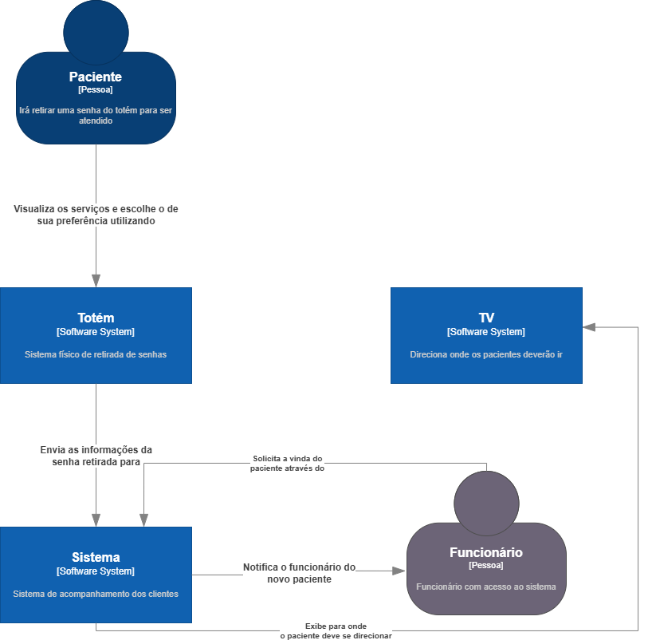

# Requerimentos de Software

## Escopo do projeto

O projeto Aura é composto por três componentes principais. O Totem permite que os pacientes retirem senhas de atendimento por meio de uma interface intuitiva, com suporte para traduções em inglês, espanhol e Libras, garantindo acessibilidade a diversos usuários.

O Visor exibe as senhas e as respectivas portas de atendimento em tempo real, com narração das chamadas para tornar o processo mais inclusivo e eficiente.

O Sistema central gerencia tanto os pacientes quanto os usuários, possibilitando a visualização e atendimento das senhas em tempo real, além do gerenciamento de contas e salas. O sistema também inclui dashboards que fornecem uma visão detalhada do fluxo de atendimentos, apresentando estatísticas como senhas emitidas, atendimentos realizados e tempos médios de espera e atendimento.

## Features

### Artigos Técnicos

### Aura
É um sistema integrado composto por três elementos principais:  

1. **Totem de autoatendimento**: permite que os pacientes retirem senhas de forma prática, conforme o serviço desejado.  
2. **Visor de chamadas**: exibe as senhas em tempo real para organizar o fluxo de atendimento.  
3. **Sistema interno**: gerencia o fluxo de pacientes, facilitando o controle e otimizando o atendimento. Ele também gera relatórios detalhados, com painéis analíticos, permitindo uma análise completa do histórico de atendimentos.  

O Aura é uma solução completa para modernizar e simplificar o gerenciamento de atendimentos.

## Descrição de Requisitos

### Requisitos Funcionais

#### 1. Funcionalidades do Totem
O **totem físico** será um elemento essencial para tornar o atendimento mais acessível e eficiente. Ele contará com as seguintes funcionalidades:  

1. **Interface de Retirada de Senhas**  
   - Permite que o paciente selecione o tipo de atendimento desejado (e.g., Enfermagem, Medicina).  

2. **Geração Automática de Senhas**  
   - As senhas serão criadas com uma formatação específica, conforme o serviço escolhido (e.g., *EN-001* para Enfermagem).  

3. **Impressão de Senha Física**  
   - Após a geração da senha, ela será impressa de forma imediata para o paciente.  

4. **Atendimento Emergencial Prioritário**  
   - Em casos de emergência, o sistema direcionará automaticamente o paciente para o atendimento prioritário, eliminando a necessidade de retirar uma senha regular.  

5. **Tradução Automática**  
   - A interface será traduzida automaticamente para inglês e espanhol, facilitando o atendimento a pacientes estrangeiros.  

6. **Tradução em Libras (Acessibilidade)**  
   - Suporte à tradução em Libras (Língua Brasileira de Sinais), garantindo acessibilidade plena a pacientes com deficiência auditiva.  

Essas funcionalidades fazem do totem um componente inclusivo e eficaz no gerenciamento do fluxo de atendimentos.
#### 2. Funcionalidades do Visor
O **visor** é projetado para exibir informações claras e em tempo real, auxiliando os pacientes durante o atendimento. Suas principais funcionalidades são:  

1. **Exibição de Senha e Localização**  
   - Mostra a senha chamada, incluindo o número e as iniciais do serviço (e.g., *EN-001*), junto com a indicação da porta ou local onde o paciente deve se dirigir.  

2. **Histórico de Senhas Atualizado em Tempo Real**  
   - Atualiza dinamicamente a lista de senhas à medida que novos atendimentos são realizados, garantindo que as informações exibidas estejam sempre corretas.  

3. **Narração da Senha**  
   - O sistema realiza uma narração automática da senha e do local de atendimento quando a chamada é feita, oferecendo maior acessibilidade e compreensão.  

Essas funcionalidades tornam o visor essencial para garantir um atendimento eficiente, organizado e acessível a todos.
#### 3. Funcionalidades do Sistema
#### 3.1. Gerenciamento de Pacientes
O sistema oferece ferramentas avançadas para gerenciar o fluxo de atendimentos com eficiência. Suas funcionalidades incluem:  

1. **Visualização em Tempo Real**  
   - Exibição instantânea das senhas geradas pelo totem, permitindo acompanhar o fluxo de atendimentos conforme ele ocorre.  

2. **Atendimento de Senhas**  
   - Permite que os atendentes chamem e atendam as senhas geradas pelo totem em tempo real.  

3. **Visualização de Informações do Atendimento**  
   - Apresenta os detalhes da senha atendida, como o serviço solicitado e informações do paciente, durante o atendimento.  

4. **Encaminhamento de Atendimento**  
   - Oferece a opção de encaminhar o paciente para outra especialidade ou setor, caso necessário.  

5. **Finalização de Atendimento**  
   - Inclui um método prático para encerrar o atendimento e remover o paciente da lista de espera.  

6. **Adição de Pacientes Online**  
   - Permite o cadastro de novos pacientes por meio de um formulário online, incluindo informações como nome, data e serviço desejado.  

7. **Acompanhamento de Status de Paciente**  
   - Monitoramento em tempo real do status de cada paciente, com acesso restrito à equipe de recepção para maior organização.  

Essas funcionalidades garantem um gerenciamento otimizado, proporcionando uma experiência mais organizada e ágil tanto para os pacientes quanto para a equipe.
#### 3.2. Gerenciamento de Usuários
O sistema oferece funcionalidades avançadas para gerenciar usuários de maneira eficaz e segura. As principais funcionalidades incluem:  

1. **Visualização de Lista de Usuários**  
   - Exibição completa de todos os usuários cadastrados no sistema, permitindo fácil acesso às informações.  

2. **Edição e Deleção de Usuários**  
   - Administradores têm a capacidade de editar ou excluir usuários conforme necessário, garantindo controle total sobre o sistema.  

3. **Cadastro de Usuários por E-mail**  
   - Administradores podem cadastrar novos usuários, enviando um e-mail com um código de verificação para o primeiro login.  

4. **Primeiro Login para Usuários Internos**  
   - Durante o primeiro login, os usuários internos devem completar seus dados (e.g., nome, sobrenome, especialidade).  

5. **Login via Azure SSO (Usuários Internos)**  
   - Usuários internos podem acessar o sistema utilizando login via Azure Single Sign-On (SSO), garantindo maior segurança e praticidade.  

6. **Primeiro Login para Usuários Externos**  
   - Usuários externos também devem completar seus dados no primeiro login (e.g., nome, sobrenome, especialidade).  

7. **Login por EDV e Senha (Usuários Externos)**  
   - Usuários externos podem acessar o sistema utilizando seu EDV (Número de Identificação) e senha.  

8. **Escolha de Sala no Login**  
   - O login será concluído apenas após a escolha de uma sala de atendimento, organizando o fluxo de trabalho.  

9. **Visualização e Gerenciamento de Salas**  
   - Administradores podem visualizar salas disponíveis e adicionar ou deletar salas conforme a necessidade.  

10. **Página de Suporte**  
    - Uma página com os contatos dos desenvolvedores do projeto estará disponível para todos os usuários, garantindo suporte técnico sempre que necessário.  

Essas funcionalidades proporcionam um gerenciamento completo de usuários, com foco na segurança, praticidade e controle, garantindo um ambiente funcional e organizado.
#### 4. Dashboards
O sistema incluirá dashboards interativos para facilitar o monitoramento e análise de dados relacionados ao atendimento. As principais funcionalidades incluem:  

1. **Dashboard Interativo**  
   - Exibição visual do fluxo diário de pacientes, com controle detalhado sobre os tipos de atendimentos e serviços prestados.  

2. **Integração com MetaBase**  
   - Todos os dashboards serão integrados ao sistema por meio da ferramenta MetaBase, proporcionando uma visualização dinâmica e interativa dos dados.  

3. **Tipos de Dashboards Disponíveis**  
   - **Total de senhas retiradas no totem por data**: Monitoramento diário das senhas retiradas, permitindo análise do volume de atendimento por período.  
   - **Total de senhas por serviço**: Exibição das quantidades de senhas retiradas por tipo de serviço, ajudando a identificar a demanda em cada área.  
   - **Total de atendimentos por usuário**: Análise da quantidade de atendimentos realizados por cada usuário, possibilitando o acompanhamento do desempenho individual.  
   - **Tempo de atendimento por usuário**: Visualização do tempo médio gasto por cada usuário em cada atendimento, permitindo otimizações no fluxo de trabalho.  
   - **Média de tempo total do paciente no ambulatório**: Cálculo do tempo médio que um paciente passa desde a entrada até o final do atendimento, auxiliando na avaliação da eficiência do processo.  
   - **Média de tempo de espera do paciente na recepção até o atendimento**: Exibição do tempo médio de espera dos pacientes, permitindo ajustes na gestão de filas e agendamentos.  

Esses dashboards interativos oferecem dados valiosos para a gestão e otimização dos processos de atendimento, melhorando a eficiência e a experiência tanto para os pacientes quanto para a equipe.
#### 5. Controle de Acesso
O sistema implementará um controle de acesso rigoroso, garantindo que cada usuário tenha permissões específicas conforme seu papel. Os dois níveis de acesso definidos são:

1. **Administrador**  
   - **Acesso Completo ao Sistema**: Permissão para gerenciar todos os aspectos do sistema, sem restrições.  
   - **Cadastro, Edição e Remoção de Usuários**: Capacidade de adicionar, editar ou excluir usuários do sistema.  
   - **Gerenciamento de Salas**: Administradores podem adicionar ou remover salas de atendimento conforme a necessidade.  
   - **Gerenciamento de Serviços no Totem Físico**: Permissão para habilitar ou desabilitar serviços disponíveis no totem de autoatendimento, ajustando as opções conforme a demanda.  

2. **Usuário**  
   - **Acesso Limitado**: Usuários terão acesso restrito, de acordo com as permissões atribuídas pelo administrador. Isso pode incluir a visualização de informações específicas ou a execução de tarefas específicas, mas sem a capacidade de modificar configurações do sistema.  

O login será realizado através de **nome de usuário único e senha segura**, garantindo que cada acesso seja controlado e seguro, de acordo com o nível de permissão atribuído a cada usuário.

### Requisitos Não Funcionais

#### Requisitos de Usabilidade
1.1      O sistema deve ser acessível via navegador da web.

1.2      A aplicação deve ter uma interface amigável e intuitiva, facilitando a navegação e a execução das tarefas pelos usuários.

1.3      A aplicação deve ser acessível a usuários com diferentes necessidades, incluindo suporte a leitores de tela e narração em libras.

1.4      A aplicação deve ter documentação adequada para desenvolvedores e administradores, facilitando a manutenção e futuras atualizações.

#### Requisitos de Desempenho
1.1      O tempo de resposta para registrar uma entrada ou saída de estoque não deve exceder 2 segundos.

1.2      O sistema deve suportar até 100 usuários simultâneos.

#### Requisitos de Segurança
1.1      O sistema deve garantir a segurança dos dados utilizando protocolos HTTPS.

1.2      Apenas usuários autorizados devem ter acesso a funcionalidades administrativas e dados sensíveis.

## Anexos e Apêndices

### Diagrama C4
Representa a arquitetura de software em quatro níveis de detalhe (contexto, container, componente, e código) para descrever tanto a visão geral quanto a estrutura interna do sistema.

### Diagrama de Caso de Uso
Mostra as interações entre usuários (atores) e o sistema, descrevendo funcionalidade e fluxos de operações principais de forma visual e simplificada.

### Diagrama BCD (Block Definition Diagram)
No contexto de sistemas baseados em UML/SysML, define a estrutura do sistema em blocos, mostrando relações de composição, associações, e as propriedades dos elementos.

