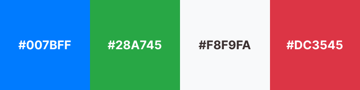

# UX-UI

## Stack Tecnológica

### Princípios de Design

### Simplicidade e Clareza 
O sistema foi projetado para facilitar o uso por profissionais da saúde e pacientes, que podem não ter familiaridade com tecnologia. Por isso, as telas são simples e diretas, com linguagem clara e sem elementos excessivos.

### Eficiência
O fluxo de retirada de senhas e atendimento foi otimizado para ser o mais rápido possível, com o mínimo de cliques e recarregamento de páginas, maximizando a eficiência do atendimento no ambulatório.

### Consistência
O design segue padrões consistentes, com elementos visuais como botões, cores e tipografia sendo utilizados de forma homogênea em todas as páginas.

## Identidade Visual 

### Logotipo e Branding
O logotipo do sistema foi projetado para refletir a natureza profissional e de saúde do ambulatório. O uso de ícones simples e cores associadas a saúde (ex.: verde e azul) reforça a identidade do sistema.

### Paleta de cores
**Cor Primaria**
- Azul (#007BFF) – Transmite confiança e profissionalismo. Utilizada nos botões principais e nas áreas de destaque.

**Cor Secundária**
- Verde (#28A745) – Associada à saúde e bem-estar, utilizada nos botões de confirmação, como o de "Atender".

**Neutros**
- Cinza claro (#F8F9FA) para fundos e branco (#FFFFFF) para textos e caixas, oferecendo contraste suficiente sem sobrecarregar a interface.

**Alerta**
- Vermelho (#DC3545) – Usada para mensagens de erro ou alertas, como no caso de falha no sistema.

## Layout
### Responsividade 
O design foi pensado para ser adaptado tanto para telas grandes (computadores e TVs) quanto pequenas (totens e notebooks). Componentes se reorganizam sem perder funcionalidade.

### Espaçamento
Utilizamos bastante espaçamento em branco para evitar sobrecarregar o usuário com informações. As áreas interativas, como botões, possuem espaçamento amplo para serem facilmente clicadas.

## Componentes da Interface
### Botões
Botões Principais
Em azul, chamando a atenção para ações principais como "Atender" ou "Confirmar".
Botões Secundarios
Ex.: "Cancelar" em cinza, mantendo um destaque menor.

### Formulários
O formulário de retirada de senha no totem é extremamente simples, pedindo apenas o nome do paciente e o serviço desejado. As caixas de texto são grandes e com labels claras.
O feedback é imediato, com mensagens de sucesso ou erro logo abaixo do campo preenchido.

### Mensagens de Feedback
Mensagens de erro em vermelho com ícones de alerta.
Mensagens de sucesso em azul, com ícones de check, aparecendo na tela.

### Modais
Usados para confirmar ações importantes, como a exclusão de um registro. A cor primária é utilizada para o botão de ação no modal, e cores secundárias para "Cancelar".

## Fluxo de navegação
### Totem 
Tela inicial simples, com apenas duas opções: "Retirar Senha" e "Ver Senhas". Após retirar a senha, o usuário recebe um feedback visual com o número da senha gerada.

### Sistema de Gerenciamento
Tela de administração com abas claras para acessar diferentes áreas do sistema: "Atendimentos", "Histórico", "Gerenciar Serviços". A lista de senhas é o principal foco, com as opções de "Atender" ao lado de cada senha.

### TV/Display
A tela da TV exibe a senha atual e a próxima, mantendo o conteúdo fixo e atualizado em tempo real. A interface é limpa, com foco na visualização clara das senhas e no serviço correspondente.

## Prototipagem
Durante o processo de desenvolvimento, foram criados protótipos utilizando ferramentas como Figma para garantir que a interface atendesse às necessidades tanto dos profissionais da saúde quanto dos pacientes.

## Acessiblidade
Tamanho de Fonte: Usamos tamanhos de fonte grandes e fáceis de ler, especialmente nas telas do totem e da TV.
Libras: Usamos tradutor para Libras 

<!-- ## Wireframes e Mockups
(Fotos das telas) -->

